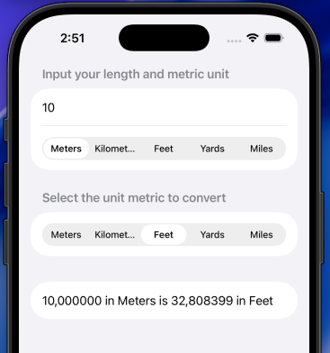

# Length Conversion

Una aplicación simple para convertir unidades de medidas, construida 100% con **SwiftUI**. :) 

## Características
* **Conversión de longitudes:** Convierte entre metros, kilómetros, pies, yardas y millas.
* **Cálculo en tiempo real:** El resultado se actualiza automáticamente al cambiar el valor o las unidades.
* **Interfaz simple:** Uso de pickers segmentados para seleccionar unidades.
* **Conversión precisa:** Utiliza metros como unidad base para garantizar resultados correctos.

## Tecnologías
* Swift
* SwiftUI

